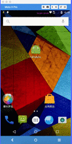

# PullToRefreshLayout
===================

> **Pull Refresh Layout Library , If you have any question or suggestion  with this library , welcome to tell me !**

## Introduction
`PullToRefreshLayout`是一个用法同系统`SwipeRefreshLayout`可灵活自定义下拉刷新、上拉加载视图的Android库.


## Demo


## Usage

### Step 1

>Add this in your root `build.gradle` file (**not** your module `build.gradle` file):

``` Gradle
allprojects {
	repositories {
		...
		 maven {
                url "http://dl.bintray.com/changjiashuai/maven"
         }
	}
}
```

#### Dependency

>Add this to your module's `build.gradle` file:

```Gradle
dependencies {
    compile fileTree(dir: 'libs', include: ['*.jar'])
    testCompile 'junit:junit:4.12'
    compile 'com.android.support:appcompat-v7:24.2.0'
    ...
    compile 'io.github.changjiashuai:pulltorefresh:1.0.0'
    ...
}
```


### Step 2

Add the PullToRefreshLayout to your layout:

Simple 

```java
    <io.github.changjiashuai.pulltorefresh.PullToRefreshLayout
            android:id="@+id/pullToRefreshLayout"
            android:layout_width="match_parent"
            android:layout_height="match_parent">
            
        <android.support.v7.widget.RecyclerView
                android:id="@+id/recyclerView"
                android:layout_width="match_parent"
                android:layout_height="match_parent"/>
                
    </io.github.changjiashuai.pulltorefresh.PullToRefreshLayout>
```

### Step 3

It's very simple use just like .
```java
   mRecyclerView = (RecyclerView) findViewById(R.id.recyclerView);
   mPullToRefreshLayout = (PullToRefreshLayout) findViewById(R.id.pullToRefreshLayout);
   
   mPullToRefreshLayout.setOnRefreshListener(new PullToRefreshLayout.OnRefreshListener() {
          @Override
          public void onRefresh() {
              Log.i(TAG, "onRefresh: ");
              mRecyclerView.postDelayed(new Runnable() {
                @Override
                public void run() {
                    mAdapter.setStrings(initData());
                    mPullToRefreshLayout.endRefresh();
                }
              }, 1000);
          }
   });
   mPullToRefreshLayout.setOnLoadMoreListener(new PullToRefreshLayout.OnLoadMoreListener() {
          @Override
          public void onLoadMore() {
              Log.i(TAG, "onLoadMore: ");
              mRecyclerView.postDelayed(new Runnable() {
                @Override
                public void run() {
                    mAdapter.insert(addData());
                    mPullToRefreshLayout.endLoadMore();
                }
              }, 1000);
          }
   });
   mRecyclerView.postDelayed(new Runnable() {
        @Override
        public void run() {
           mPullToRefreshLayout.autoRefresh();
        }
   }, 500);
   
   
   //可选设置
   mPullToRefreshLayout.setHeaderHeight(200);//设置刷新视图刷新时高度， 可滑动高度是这个的2倍
   mPullToRefreshLayout.setFooterHeight(200);//设置上拉视图加载时高度， 可滑动高度是这个的2倍
        
   mPullToRefreshLayout.setCanRefresh(false);//设置是否开启下拉刷新功能
   mPullToRefreshLayout.setCanLoadMore(false);//设置是否开启上拉加载功能
   
   // 默认使用 HeaderView FooterView  --> 可自定义支持任意View
   mPullToRefreshLayout.setHeaderView(mHeaderView);//替换默认下拉刷新视图
   mPullToRefreshLayout.setFooterView(mFooterView);//替换默认上拉加载视图
```

## Custom HeaderView and FooterView

See [HeaderView](https://github.com/changjiashuai/PullToRefreshLayout/tree/master/pulltorefresh/src/main/java/io/github/changjiashuai/pulltorefresh/HeaderView.java), [FooterView](https://github.com/changjiashuai/PullToRefreshLayout/tree/master/pulltorefresh/src/main/java/io/github/changjiashuai/pulltorefresh/FooterView.java) in pulltorefresh.


##Contact me

 If you have a better idea or way on this project, please let me know, thanks :)

[Email](mailto:changjiashuai@gmail.com)


### License
```
Copyright 2016 changjiashuai

Licensed under the Apache License, Version 2.0 (the "License");
you may not use this file except in compliance with the License.
You may obtain a copy of the License at

   http://www.apache.org/licenses/LICENSE-2.0

Unless required by applicable law or agreed to in writing, software
distributed under the License is distributed on an "AS IS" BASIS,
WITHOUT WARRANTIES OR CONDITIONS OF ANY KIND, either express or implied.
See the License for the specific language governing permissions and
limitations under the License.
```